# Security & Architecture Recommendation Report: Milestone 3B

**Target Audience:** Engineering Leadership, SOC2 Compliance Officers, Core Backend Team  
**Subject:** High-Risk Vulnerability Identification, Impact Assessment, and Milestone 3B Remediation Roadmap.

---

## 1. Executive Summary

Following the successful completion of Milestones 1, 2, and 3A (which secured Row-Level Security, multi-tenant boundaries, and basic Role-Based Access Control), we performed an exhaustive security and architectural review of the remaining platform boundaries.

While the core database multi-tenancy is now highly secure, major operational, financial, and availability risks exist on the **API ingress layers**, the **file upload pipelines**, and **external LLM integrations**. This document ranks these risks from highest to lowest business impact and provides a target roadmap for **Milestone 3B** to establish production-grade defense-in-depth.

---

## 2. Risk Ranking & Business Impact Assessment

We have evaluated and ranked the remaining platform gaps by combining their likelihood of exploitation with their potential business consequences (financial, legal, reputational, and service downtime):

```mermaid
gantt
    title Remaining Risks Severity & Priority Matrix
    dateFormat  X
    axisFormat %s
    
    section High Impact
    Cost Exhaustion & Groq API Abuse (Rate Limiting) :active, task1, 0, 10
    Upload Resource Exhaustion (DoS / Zip Bombs)     :active, task2, 0, 8
    Un-revocable Stateless JWT Tokens                :active, task3, 0, 7
    Malware Distribution (Un-scanned PDF Uploads)    :active, task4, 0, 7
    
    section Medium Impact
    Synchronous Blocking External LLM Calls         :active, task5, 0, 5
    Hardcoded Fallback Secrets                       :active, task6, 0, 4
    Absence of Compliance Auditing & Log Trail       :active, task7, 0, 3
    Email Domain Abuse (Spam Reputation)             :active, task8, 0, 2
```



---

### [CRITICAL RISK 1] Groq API Cost Abuse & LLM Rate Limits
* **Vulnerability:** The `/api/screen`, `/api/screen/upload`, and `/api/recruit` endpoints perform deep, direct LLM calls to the Groq API. There is **zero rate limiting** enforced on these API entrypoints.
* **Business Impact:** **Extremely High (Financial & Availability)**. A simple script could spam the endpoints, generating massive cloud/API bills within minutes. Furthermore, this would exhaust the company's Groq API rate limits (TPS/TPM), completely taking down the resume screening services for all active, paying SaaS tenants.
* **Remediation:** Enforce API Rate Limiting on the FastAPI layer using Redis-backed rate-limiters (e.g. `slowapi`) restricting IP addresses/authorized tokens.

### [CRITICAL RISK 2] Upload Resource Starvation & Zip Bomb Attacks
* **Vulnerability:** The resume upload endpoints read the uploaded file bytes directly into memory (`file.read()`) with **no size limit** configuration. 
* **Business Impact:** **High (Availability / DoS)**. Uploading multiple massive files or custom "zip bombs" concurrently will exhaust the server's RAM, triggering kernel Out-Of-Memory (OOM) killer routines and causing immediate, catastrophic application downtime.
* **Remediation:** Implement a strict HTTP request body size limit middleware (e.g. max 5MB per resume file) and reject files exceeding the boundary before reading them into memory.

### [HIGH RISK 3] Un-revocable Stateless JWT Access Tokens
* **Vulnerability:** JWT tokens are stateless, signed, and have a default lifespan of 60 minutes. There is **no logout blacklist or database tracking**.
* **Business Impact:** **High (Confidentiality & Compliance)**. If a user logs out from a shared machine or if a token is intercepted/leaked, the token remains fully valid and active until its natural expiration. A compromised token cannot be revoked, exposing sensitive candidate datasets and violating SOC2 access control standards.
* **Remediation:** Introduce a lightweight Redis-based or database-backed blacklist to invalidate tokens instantly upon `/auth/logout` or user deletion, and transition to a secure short-lived Access Token / long-lived Refresh Token architecture.

### [HIGH RISK 4] Malware Distribution via Resume Uploads
* **Vulnerability:** The upload pipeline parses files based solely on their extension (`.pdf`). It does not validate file magic headers (mime-types) and performs no antivirus screening.
* **Business Impact:** **High (Reputation, Legal & Security)**. In a recruiting SaaS, corporate recruiters download candidate resumes. If an attacker uploads a malware-infected PDF, and the platform distributes it, it will infect client workstations, exposing the SaaS provider to severe legal liability and permanent brand damage.
* **Remediation:** Enforce strict file magic signature validation (using `python-magic`) and integrate a virus scanning service (e.g. ClamAV or a cloud scanner API) to reject malicious uploads.

### [MEDIUM RISK 5] Synchronous Blocking External LLM Calls
* **Vulnerability:** Heavy, time-consuming candidate processing (`process_candidate`) is executed synchronously within the FastAPI thread pool during the HTTP request lifecycle.
* **Business Impact:** **Medium (Availability & Reliability)**. Deep screening and document generation can take 10-20 seconds. Synchronously blocking thread workers causes threadpool starvation. If multiple candidates are uploaded at once, the server sluggishly times out for all users.
* **Remediation:** Migrate the screening pipeline to a background task queue (e.g., Celery, RQ, or FastAPI's `BackgroundTasks`), instantly returning a `202 Accepted` status and polling/websocket endpoints.

### [MEDIUM RISK 6] Insecure Production Fallback Secrets
* **Vulnerability:** `backend/core/config.py` hardcodes a default `JWT_SECRET_KEY` fallback string (`"change-me-in-production"`).
* **Business Impact:** **Medium (Confidentiality)**. If environment configurations are misconfigured or skipped in production, the system silently falls back to a publicly visible key, allowing attackers to easily forge admin tokens.
* **Remediation:** Refactor configuration loading to throw a loud startup error and refuse to boot if `JWT_SECRET_KEY` is not set when `ENV == "production"`.

### [MEDIUM RISK 7] Lack of Auditing or Structured Log Trails
* **Vulnerability:** The system does not maintain structured logs of security-sensitive operations.
* **Business Impact:** **Medium (Compliance & Forensics)**. SOC2 and ISO27001 require tracking who viewed, modified, or deleted candidate/user data. The lack of audit trails prevents security compliance certifications and leaves developers blind during post-incident forensics.
* **Remediation:** Integrate a structured logging middleware that records user actions, tenant IDs, IP addresses, and resource IDs.

---

## 3. Recommended Milestone 3B Roadmap

To completely secure the ingress and processing layers of the application, we recommend executing **Milestone 3B** with the following priority plan:

```
[Phase 1: Ingress Protection] --> [Phase 2: Payload Security] --> [Phase 3: Token Invalidation]
  - Limit request body size         - Strict Mime Validation         - Redis JWT Blacklist
  - slowapi Rate Limiter            - ClamAV Antivirus Check          - /auth/logout endpoint
```

### Phase 1: Ingress Security & Resource Protection (Priority 1)
1. **API Rate Limiting:** Install `slowapi` and enforce rate limits on authentication and file upload endpoints.
2. **Request Body Size Limits:** Add custom FastAPI middleware restricting raw request payload sizes to 5MB on the resume upload route.
3. **Hardened Configuration:** Force immediate system crash on startup if `JWT_SECRET_KEY` is not configured when running in production environment.

### Phase 2: Resume Payload Validation (Priority 2)
1. **Magic Header Checks:** Utilize `python-magic` to inspect file signature bytes, rejecting renamed executables or non-PDF streams.
2. **Virus Screening:** Integrate `python-clamd` or a lightweight cloud scanner API to scan PDF streams before parsing.

### Phase 3: JWT Revocation & Session Lifecycle (Priority 3)
1. **Logout & Blacklist:** Implement the `/auth/logout` route and configure a Redis cache store to blacklist active JWTs until their expiration.
2. **Company Status Hook:** Ensure company suspension validation operates on the blacklisting layer to automatically invalidate all active sessions of a suspended tenant.
