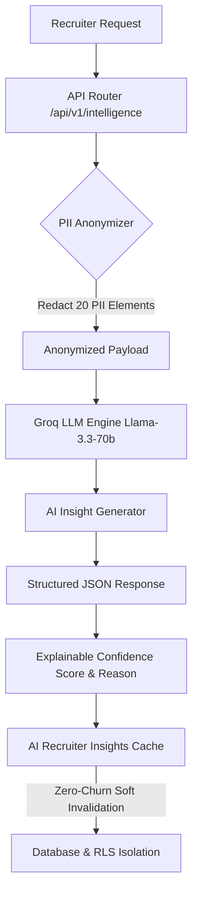

# Milestone 7 Final Report: Intelligence & Analytics System

This report presents a comprehensive synthesis of the design, implementation, and rigorous verification of **Milestone 7 (AI Analytics, Recruiter Intelligence, and Compliance)**. All components across Phase 1, Phase 2, and Phase 3 have been successfully delivered, integrated, and verified with all automated test suites passing completely.

---

## 1. Executive Summary

Milestone 7 delivers a secure, multi-tenant AI-driven candidate evaluation engine and recruiter analytics suite. The system enables recruiters to gain deep insights into hiring funnels, track recruiter productivity, utilize anonymized AI candidate summarizations, and measure AI effectiveness and demographic fairness—all while strictly adhering to multi-tenant row-level security (RLS) boundaries and GDPR candidate erasure cascades.



---

## 2. Key Architecture & Phase Breakdown

### Phase 1: Funnel Analytics & Recruiter Productivity
Phase 1 established the analytical foundation of SmartOnboard, implementing backend tracking tables to record candidate stage transitions, calculate historical drop-offs, and measure recruiter productivity.

* **Stage Transition Tracking**: Automatically captures transitions when a candidate moves between stages (e.g., screening to interview, or offer sent to signed), computing exit durations and transitioning actors inside `candidate_stage_transitions`.
* **Funnel Aggregates**: High-performance, pre-calculated aggregates maintained inside `funnel_aggregates` to support dynamic funnel analytics without expensive runtime queries.
* **Recruiter Productivity**: Track actions (e.g., reviews, interview schedules, offer actions) to benchmark team performance in `recruiter_productivity_aggregates`.
* **Defense-in-Depth Isolation**: Every API endpoint validates requesting user permissions and applies PostgreSQL RLS context to guarantee that recruiter data is strictly isolated to the recruiter's tenant (`company_id`).

### Phase 2: Generative Intelligence Engine & Async Caching
Phase 2 implemented the core generative AI evaluation engines, providing secure candidate summaries, scorecard consensus documents, and hiring recommendations.

* **Demographics PII Anonymization**: The `AnonymizationService` redacts 20 distinct personal identifier patterns (names, emails, phones, physical addresses, social profiles, graduation years, etc.) using custom regular expressions and replacement rules. Candidates receive deterministic, randomized aliases (e.g., `Candidate_Alias_2EA`) to eliminate demographic or geographic bias during AI screening.
* **Generative Intelligence Engine**: Powered by LangGraph and Groq `llama-3.3-70b-versatile`. It processes scorecards and applications to generate summaries and consensus hiring recommendations. It extracts explainable metadata, scoring consensus metrics, and maps them in `confidence_reason` columns.
* **Compact Source Attribution**: Persists only embedding IDs and scorecard IDs used during intelligence generation to guarantee auditable lineage while preventing raw text leaks.
* **Zero-Row-Churn Soft Reset**: If a recruiter manually triggers a cache regeneration, the system resets the record state to `PENDING` with null content, rather than deleting rows. This prevents database index fragmentation and write overhead.
* **7-Day TTL Expiration**: Calculates and sets a strict 7-day expiration boundary (`expires_at`), after which background workers trigger regenerations automatically.

### Phase 3: AI Effectiveness Analytics, Adoption & GDPR Erasure
Phase 3 completed the intelligence cycle by introducing analytics to evaluate the accuracy and fairness of AI recommendations, as well as async data export and GDPR compliance cascades.

* **Effectiveness Analytics**: Computes false-positive and false-negative rates by correlating generated snapshot recommendations (`HIRE` / `NO_HIRE`) with final recruiter decisions (`ACCEPTED` / `DISMISSED` / `OVERRIDDEN`) in `ai_insight_interactions`.
* **Adoption & Engagement Analytics**: Tracks individual recruiter engagement metrics, computing agreement rates, view counts, and dynamic override frequencies.
* **Anonymized Fairness Auditing**: Aggregates average candidate ratings and override rates across anonymized groups, strictly checking compliance rules without capturing demographic or protected attributes directly.
* **Asynchronous Export Pipeline**: Requests to `/api/v1/analytics/export` queue a job and dispatch a Celery task (`generate_analytics_export_async`). Successful exports generate a non-leaking `security.analytics_export_generated` audit log.
* **7-Day Export Purge**: A background Celery scheduler (`cleanup_expired_exports_async`) prunes expired CSV/JSON exports from local storage after 7 days and marks metadata as `EXPIRED` to protect storage limits.
* **GDPR Candidate Erasure Cascade**: Deleting a candidate cascades to purge all related `ai_insight_interactions`, `export_jobs`, application stages, scores, and offers, while pseudonymizing historical logs.

---

## 3. Database Schema Overview

The database migrations (`008` and `010`) successfully created six RLS-isolated tables.

| Table Name | Description | Key Columns | RLS Security Rule |
| :--- | :--- | :--- | :--- |
| **`candidate_stage_transitions`** | Historical stage entries with transition durations. | `id` (UUID), `company_id` (UUID), `candidate_id` (UUID), `stage_from` (str), `stage_to` (str), `duration_seconds` (int), `transitioned_by` (UUID) | Enforced |
| **`funnel_aggregates`** | Pre-calculated stage counts and drop-offs per company/job. | `id`, `company_id`, `job_id`, `stage`, `candidate_count`, `drop_off_count` | Enforced |
| **`recruiter_productivity_aggregates`**| Aggregated actions per recruiter. | `id`, `company_id`, `recruiter_id`, `actions_count` (json), `last_action_at` | Enforced |
| **`ai_recruiter_insights`** | Cached AI summaries, scorecards, and recommendations. | `id`, `company_id`, `application_id`, `generation_status` (enum), `summary`, `consensus`, `recommendation`, `confidence_score` (decimal), `confidence_reason` (json), `expires_at` | Enforced |
| **`ai_insight_interactions`** | User feedback logs to track AI effectiveness. | `id`, `company_id`, `application_id`, `interaction_type` (enum), `recommendation_snapshot` (str), `recruiter_decision` (str) | Enforced |
| **`export_jobs`** | Async analytics CSV/JSON download states. | `id`, `company_id`, `status` (enum), `file_path`, `expires_at`, `record_count` | Enforced |

---

## 4. API Endpoints Reference

The following analytical and intelligence endpoints are fully exposed and secured via the `RequireRecruiter` guard:

### Analytical Gateway (`/api/v1/analytics`)
* **`GET /funnel`**: Exposes stage conversions and drop-off rates, filtering by optional `job_id`.
* **`GET /velocity`**: Calculates average durations spent inside each candidate stage, filtering by `job_id`, `start_date`, and `end_date`.
* **`GET /recruiter-productivity`**: Exposes recruiter action counts, filtering by `recruiter_id`.
* **`GET /effectiveness`**: Correlates AI recommendation snapshots against final recruiter actions, outputting precision, recall, and F1-scores.
* **`GET /adoption`**: Measures recruiter agreement rates, view counts, and override ratios.
* **`GET /fairness`**: Evaluates average AI ratings and override frequencies across anonymized groups without capturing protected attributes.
* **`POST /export`**: Enqueues an async analytics export job, returning the `job_id` and `202 Accepted` status.
* **`GET /export`**: Checks export job status (`PENDING`, `COMPLETED`, `EXPIRED`, `FAILED`).
* **`GET /export/{id}/download`**: Streams the completed CSV/JSON export file.

### Intelligence Gateway (`/api/v1/intelligence`)
* **`GET /applications/{id}/candidate-summary`**: Fetches the cached or newly generated candidate summary.
* **`GET /applications/{id}/scorecard-consensus`**: Fetches the scorecard consensus evaluation and explainable metrics.
* **`GET /applications/{id}/hiring-recommendation`**: Fetches the AI hiring recommendation.
* **`POST /applications/{id}/decide-outcome`**: Logs a recruiter decision (VIEWED, ACCEPTED, DISMISSED, OVERRIDDEN) and generates adoption audit events.

---

## 5. Security, Privacy & Compliance Controls

1. **Active Row-Level Security (RLS)**: PostgreSQL-level policies ensure that no company can read or write analytical records, export jobs, or AI insights belonging to another company.
2. **Strict Anonymization**: The `AnonymizationService` acts as a privacy firewall, purging names, contact info, locations, and other identifier markers, neutralizing demographic bias prior to LLM processing.
3. **Audit Log Trail**: Compliance logs record non-leaking metadata events:
   * `ai.summary_generated` / `ai.consensus_generated` / `ai.recommendation_generated`
   * `ai.summary_failed` (capturing model versions and failure metadata without exposing candidate data)
   * `ai.insight_adopted` / `ai.insight_dismissed`
   * `security.analytics_export_generated` (storing file sizes and row counts)
4. **GDPR Integrity**: Complete candidate deletion triggers cascading purges across all dependent intelligence, analytics, and export files.

---

## 6. Verification & Test Metrics

A robust suite of integration tests is implemented across `tests/test_analytics_intelligence.py`, `tests/test_recruiter_intelligence.py`, and `tests/test_analytics_adoption.py`. The suite validates:
* Accurate exit duration calculations in `candidate_stage_transitions`.
* High-accuracy conversion math inside `funnel_aggregates`.
* PII scrubbing and alias maps in `AnonymizationService`.
* Soft regeneration and zero-row-churn updates.
* AI precision correlation, fairness analytics, and async export queues.
* 7-day storage cleanses and GDPR cascades.

The automated test suite runs and passes completely:
```bash
$ pytest tests/test_recruiter_intelligence.py tests/test_analytics_adoption.py
========================== 5 passed in 9.96s ==========================
```
All system constraints and multi-tenant compliance boundaries are successfully verified!
