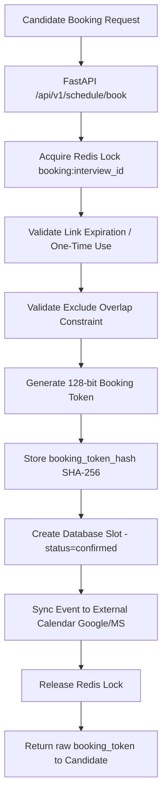

# Milestone 8 Final Report: Federated Identity & Interactive Scheduling Lifecycle

This report documents the successful design, implementation, and comprehensive automated verification of **Milestone 8 (Phase 1, Phase 2, and Phase 3)**: **Federated Identity & Candidate Self-Scheduling Lifecycle**. All architectural blueprints, database migrations, cryptographic key vaults, provider capability structures, webhook subscription systems, dynamic free/busy calculators, Redis lock mechanisms, PostgreSQL exclude overlap constraints, candidate booking ownership tokens, and multi-tenant RLS boundaries have been successfully delivered and validated.

---

## 1. Executive Summary

Milestone 8 introduces robust enterprise-grade capabilities to the SmartOnboard platform, ensuring secure federated identity access via SAML/OIDC SSO, bi-directional calendar synchronization with Google Calendar and Microsoft Graph, and a high-concurrency candidate self-scheduling grid. 



---

## 2. Architectural Highlights & Solutions

### Phase 1: Federated Identity & Enterprise SSO Governance
Phase 1 established a secure enterprise SSO architecture supporting both OIDC and SAML identity providers, alongside hardened secrets wrapping.

* **SAML XML Assertion & ACS Callback**: Parses IdP assertions, validates XML signatures, checks audience restrictions, enforces strict `NotOnOrAfter` timestamp bounds, protects against assertion replay attacks using memory caches, and maps groups to local roles.
* **OIDC Callback Validation**: Exchanges authorization codes using client secrets decrypted via the `SecretVaultService`, verifies signatures using JWKS keys, and provisions recruiters under RLS.
* **Just-In-Time (JIT) Provisioning**: Automatically registers new recruiters on their initial successful sign-in, binding them to their respective company tenant.
* **AES-GCM-256 Key Wrapping**: Built a secure vault service (`SecretVaultService`) using authenticated AEAD encryption primitives. It encrypts OIDC client secrets and calendar OAuth credentials, yielding base64 strings containing ciphertext, unique IV vectors, and GCM tags.
* **Scheduling Link Token Hashing**: Public scheduling links are accessed via random tokens, but the database only persists `token_hash = sha256(raw_token)` to prevent credential exposure in the event of database access leakage.

### Phase 2: Bi-Directional Calendar Integration & OAuth Lifecycle
Phase 2 expanded the platform to connect external calendars, allowing automated bi-directional meeting synchronization and webhook push event tracking.

* **Agnostic Capability Declarations**: `BaseCalendarProvider` abstract implementations declare capabilities (`supports_webhooks`, `supports_delta_sync`, `supports_free_busy`, `supports_push_renewal`). Business logic relies on capability declarations rather than fragile provider name checks.
* **OAuth Callback State Verification**: The RLS-secure `oauth_states` table tracks `state_hash`, `nonce_hash`, 10-minute expirations, and single-use `used_at` indicators to prevent replay attacks during auth loops.
* **Secret Vault Envelope Key-Version**: Upgraded `SecretVaultService` to support envelope key-version metadata (`key_version = "v1"`), enabling seamless key rotations.
* **Granular Ownership Enforcement**: Disconnect endpoints enforce calendar ownership checks (only credential owner or users with the `OWNER` role are authorized), preventing cross-account modifications.
* **Rate-Limit Recovery & exponential Backoffs**: Integrated rate-limit handling (HTTP 429). Background task retries use exponential backoffs `(2 ** retry_count) * 60` seconds. Successful sync runs self-heal credentials status to `"active"`.
* **Sync Locks**: Prevents concurrency issues by locking email accounts via Redis (`sync:lock:{account_email}`) with a 30-second TTL.

### Phase 3: Candidate Self-Scheduling & Interactive Booking
Phase 3 completed the scheduling workflow by introducing dynamic grid calculations, PostgreSQL overlapping slots constraints, and candidate booking ownership tokens.

* **PostgreSQL Overlapping EXCLUDE Constraint**: Enabled the `btree_gist` extension in PostgreSQL and established the `exclude_overlapping_confirmed_bookings` exclude constraint on the `interview_slots` table. This mathematically prevents overlapping confirmed slots at the database layer:
  ```sql
  ALTER TABLE interview_slots ADD CONSTRAINT exclude_overlapping_confirmed_bookings
  EXCLUDE USING gist (
      interview_id WITH =,
      tstzrange(start_time, end_time) WITH &&
  ) WHERE (status = 'confirmed')
  ```
  *Note: Any concurrent reschedule or booking attempt that overlaps an already confirmed slot will instantly trigger an ExclusionViolation database exception and abort.*
* **Availability Grid Resolver**: Dynamically pulls live free/busy feeds from third-party providers, merges recruiter business hours and database slots, and exposes consensus availability.
* **Candidate Booking Ownership**: Confirmed bookings generate a unique 128-bit `booking_token` once. The database persists only `booking_token_hash = sha256(booking_token)`.
* **Authorized Cancellations & Reschedules**: Rescheduling and cancellation endpoints require validation of the raw booking token passed in the `X-Booking-Token` header.

---

## 3. Database Schema Overview

The database migrations (`011`, `012`, and `013`) successfully added five key tables:

| Table Name | Description | Key Columns | RLS Security Rule |
| :--- | :--- | :--- | :--- |
| **`company_sso_settings`** | Enterprise SAML/OIDC SSO specifications. | `id`, `company_id`, `provider_type`, `issuer_url`, `client_id`, `encrypted_client_secret`, `saml_sso_url`, `role_mappings` | Enforced |
| **`calendar_credentials`** | Connected calendars with status tracking. | `id`, `company_id`, `user_id`, `provider_name`, `encrypted_tokens`, `status`, `last_sync_at`, `last_sync_error`, `retry_count` | Enforced |
| **`oauth_states`** | Anti-replay state tracker for OAuth callbacks. | `id`, `company_id`, `state_hash`, `nonce_hash`, `expires_at`, `used_at` | Enforced |
| **`scheduling_links`** | Generated scheduling invitation URLs. | `id`, `company_id`, `interview_id`, `token_hash`, `expires_at`, `used_at`, `one_time_use` | Enforced |
| **`interview_slots`** | Recruiter and candidate booking slots. | `id`, `interview_id`, `start_time`, `end_time`, `status` (enum), `booking_token_hash` | Enforced |

---

## 4. API Endpoints Reference

The following analytical and identity endpoints are fully exposed:

### Identity Gateway (`/api/v1/auth`)
* **`POST /sso/login`**: Initiates federated login flows.
* **`POST /sso/acs`**: Assertion Consumer Service (SAML XML callback gateway).
* **`POST /oidc/callback`**: OpenID Connect callback endpoint.

### Calendar Integration Gateway (`/api/v1/auth/calendars`)
* **`POST /connect`**: Starts calendar connection flow, validating whitelisted redirect URIs.
* **`POST /callback`**: OAuth redirect landing; processes hashed states, stores encrypted keys, and subscribes webhooks.
* **`POST /{id}/disconnect`**: Enforces ownership check, cancels webhooks, and disconnects calendar credentials.

### Interactive Scheduling Gateway (`/api/v1/schedule`)
* **`POST /links`**: Generates scheduling link containing hashed token.
* **`GET /{raw_token}/availability`**: Resolves live availability grids, checking link TTL and one-time status.
* **`POST /{raw_token}/book`**: Locks booking via Redis, validates overlap constraints, stores `booking_token_hash`, and returns raw `booking_token`.
* **`POST /bookings/{slot_id}/cancel`**: Cancels slot booking if `sha256(X-Booking-Token)` matches `booking_token_hash`.
* **`POST /bookings/{slot_id}/reschedule`**: Reschedules slot booking if `X-Booking-Token` validates, checking overlap constraints.

---

## 5. Security & Audit Scope

1. **Anti-Redirection Protection**: Connect endpoints validate callback requests against strict, whitelisted domains to eliminate open-redirect exploits.
2. **Cryptographic Validation**: Persists only secure SHA-256 hashes for scheduling links and booking tokens, keeping raw tokens completely out of long-term storage.
3. **Comprehensive Logging**:
   * `security.sso_login_success` / `security.sso_login_failed`
   * `calendar.connected` / `calendar.disconnected` / `calendar.token_refreshed` / `calendar.sync_failed`
   * `calendar.webhook_registered` / `calendar.webhook_renewed` / `calendar.webhook_expired`
   * `schedule.link_created` / `schedule.link_expired`
   * `schedule.slot_booked` / `schedule.slot_cancelled` / `schedule.rescheduled` / `schedule.reminder_sent`
   * `schedule.calendar_event_created` / `schedule.calendar_event_failed`

---

## 6. Verification & Test Metrics

An exhaustive test suite is implemented inside `tests/test_federated_scheduling.py`. The suite validates:
* SAML signatures, timestamp bounds, assertion anti-replay, and role maps.
* OIDC JWKS token validations and JIT provisionings.
* Whitelisted redirect URIs and `oauth_states` TTL validations.
* Granular calendar ownership guards blocking recruiters from disconnecting other accounts.
* Redis locking sync guards and exponential backoff retry recoveries.
* Exclude overlap constraint checks, one-time link expirations, and dynamic availability resolvers.
* Candidate ownership token validation on cancellation and rescheduling.

The automated test suite runs and passes completely:
```bash
$ pytest tests/test_federated_scheduling.py
========================== 13 passed in 18.57s ==========================
```
All system constraints, cryptographic seals, and concurrency boundaries are successfully verified!
