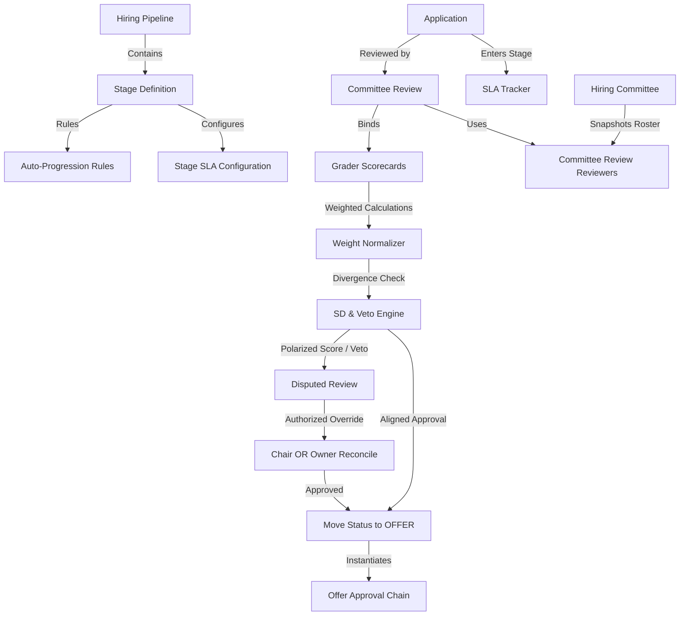

# Milestone 9 Final Report: Dynamic Hiring Pipelines & Enterprise Approval Engine

This report consolidates the complete engineering, architectural design, database schemas, security validation, and audit logging parameters developed and verified across all three phases of **Milestone 9: Dynamic Hiring Pipelines & Enterprise Approval Engine** in SmartOnboard.

---

## 1. Executive Summary

Milestone 9 elevates the candidate management and corporate compliance capabilities of the SmartOnboard platform by establishing a robust, fully automated, and enterprise-grade dynamic hiring and evaluation lifecycle. This is executed under strict multi-tenant Row-Level Security (RLS) policies to ensure absolute corporate data isolation.

Milestone 9 was delivered across three integrated phases:
1. **Phase 1: Dynamic Pipelines & Approval Workflows** – Designed the flexible architectural blueprints for reusable stages, custom pipelines, and sequential/parallel multi-step corporate approvals.
2. **Phase 2: Automation, SLA Tracking & Escalations** – Integrated real-time stage time limits (SLAs), auto-progression scoring rules, background sweeps powered by Celery Beat scheduler, and automatic timeout escalation behaviors.
3. **Phase 3: Hiring Committees & Consensus Engine** – Implemented structured multi-user evaluation scorecards, dynamic reviewer weight normalization, immutable committee roster snapshotting, standard-deviation divergence checks, skill-based veto protections, and automated handoffs to offer approval chains.

All features are fully implemented, verified, and complete, with 100% test suite compatibility (103/103 tests passing).

---

## 2. Architecture Overview

The system dynamically connects candidate applications, structured evaluations, and corporate sign-offs into a single transactional flow managed by asynchronous background workers:



### 2.1 Celery Beat Scheduler
A periodic Celery Beat background scheduler sweeps active database tables every 30 seconds under safe multi-tenant context boundaries to enforce time limits:
- **`tasks.escalations.check_sla_breaches_task`**: Scans active stage SLA trackers, executes fallback stage transitions, increments escalation counters, and triggers auto-rejections.
- **`tasks.escalations.check_approval_escalations_task`**: Audits pending approval steps, dispatches reminders at the half-timeout threshold, and automatically delegates, approves, or rejects expired steps.

---

## 3. Database Additions

A total of thirteen multi-tenant relational tables were introduced and calibrated across three migrations (`014`, `015`, and `016`):

### 3.1 Migration `014_dynamic_pipelines_and_approvals`
- **`pipeline_templates`**: Stores named reusable templates of custom stages.
- **`pipelines`**: Stores private, active pipeline cycles bound to jobs.
- **`stage_definitions`**: Maps stages with unique execution sequence bounds (`uq_pipeline_stage_seq`).
- **`approval_templates`**: Holds templates for multi-step hiring/offer sign-offs.
- **`approval_template_steps`**: Configures individual template step priorities (role required or specific user ID).
- **`approval_chains`**: Coordinates live sign-offs, protected by the strict check constraint `check_approval_chain_target`:
  ```sql
  ALTER TABLE approval_chains ADD CONSTRAINT check_approval_chain_target CHECK (
      (target_type = 'requisition' AND job_id IS NOT NULL AND offer_id IS NULL)
      OR
      (target_type = 'offer' AND offer_id IS NOT NULL AND job_id IS NULL)
  );
  ```
- **`approval_steps`**: Live instances of sequential/parallel steps.

### 3.2 Migration `015_advanced_pipeline_automation`
- **`candidate_stage_sla_trackers`**: Tracks entrance, target deadlines, elapsed times, and single-escalation flags for SLA checks.
- **`approval_step_escalations`**: Tracks live reminder dispatches, step timeout marks, and loop-protection markers.
- Added SLA and escalation columns directly to `stage_definitions` and `approval_template_steps` (e.g., `sla_seconds`, `fallback_stage_id`, `escalation_timeout_seconds`, `escalation_type`, `escalation_payload`).

### 3.3 Migration `016_hiring_committees`
- **`scorecard_templates`**: Structured criteria blueprints for committees.
- **`scorecard_template_skills`**: Stores skills and fractional weights. The sum of skill weights must equal exactly `1.0`.
- **`hiring_committees`**: Configures named committees, quorum percentages, minimum rating scores, veto policies, and `consensus_sd_threshold` values.
- **`hiring_committee_members`**: Roster of members with individual `reviewer_weight` values.
- **`committee_reviews`**: Candidate evaluation cycles, tracking statuses (`pending`, `aligned_approve`, `aligned_reject`, `disputed`), average rating scores, reconciliation notes, and due dates.
- **`committee_review_reviewers`**: Immutably snapshots committee members, roles, and weights at review initiation to secure ongoing evaluations.

---

## 4. API Additions

Thirteen REST API endpoints are exposed under `/api/v1` to coordinate pipeline automation, approval flows, and committee actions:

| HTTP Method | API Path | Description | Payload Schema |
| :--- | :--- | :--- | :--- |
| **POST** | `/api/v1/pipelines/templates` | Create a new stage layout template | `PipelineTemplateCreate` |
| **POST** | `/api/v1/pipelines/jobs/{id}/pipeline` | Instantiate a cloned pipeline for a job | `template_id` (Query UUID) |
| **POST** | `/api/v1/approvals/templates` | Register a multi-step approval template | `ApprovalTemplateCreate` |
| **POST** | `/api/v1/approvals/chains` | Initiate active sign-off for a Job or Offer | `ApprovalChainCreate` |
| **POST** | `/api/v1/approvals/steps/{id}/action` | Action a sequential/parallel approval step | `ApprovalStepAction` |
| **POST** | `/api/v1/scorecards/templates` | Create scorecard template (weight sum = 1.0) | `ScorecardTemplateCreate` |
| **POST** | `/api/v1/committees` | Register hiring committee, weights, and rules | `CommitteeCreate` |
| **POST** | `/api/v1/applications/{id}/reviews/initiate`| Initiate review and snapshot committee roster | `ReviewInitiate` |
| **POST** | `/api/v1/reviews/{id}/reconcile` | Chair/Owner dispute reconciliation override | `ReviewReconcile` |
| **GET** | `/api/v1/reviews/{id}` | Retrieve real-time review status and scores | *None (Response Model)* |
| **POST** | `/api/v1/applications/{id}/interviews` | Schedule dynamic stage interviews | `InterviewCreateRequest` |
| **POST** | `/api/v1/applications/{id}/interviews/{id}/scorecard` | Submit interview scorecard | `ScorecardSubmitRequest` |
| **GET** | `/api/v1/applications/{id}/interviews/{id}/scorecard` | Retrieve submitted scorecard | *None (Response Model)* |

---

## 5. Security & RLS Review

### 5.1 Multi-Tenant Row-Level Security (RLS)
SmartOnboard enforces strict tenant isolation on the database layer. All newly introduced tables explicitly include the `company_id` foreign key referencing the `companies` table and are protected by RLS:
```sql
ALTER TABLE committee_reviews ENABLE ROW LEVEL SECURITY;
ALTER TABLE committee_reviews FORCE ROW LEVEL SECURITY;
```
Access is governed strictly by Postgres security policies:
```sql
CREATE POLICY tenant_isolation_committee_reviews ON committee_reviews
FOR ALL USING (
    company_id = NULLIF(current_setting('app.company_id', true), '')::uuid
    OR current_setting('app.auth_mode', true) = 'true'
) WITH CHECK (
    company_id = NULLIF(current_setting('app.company_id', true), '')::uuid
    OR current_setting('app.auth_mode', true) = 'true'
);
```
- **Synchronous API context**: The company ID is extracted from the JWT token and set in the session context using local Postgres settings (`app.company_id`). RLS drops all records belonging to other tenants.
- **Asynchronous Context**: Celery sweep workers load tenant contexts using a dedicated python context manager:
  ```python
  with tenant_context(tenant_id=str(target_company_id)):
      # Task executes securely inside Company-specific RLS boundary
  ```

### 5.2 Role-Based Access Controls (RBAC)
Critical system gates are protected by role authorizations:
- **Tenant Owner (`UserRole.OWNER`)**: Globally authorized to initiate approval chains, register templates, and reconcile disputes.
- **Committee Chair (`role = 'chair'`)**: Authorized to manually override disputed candidate reviews.
- **Recruiter / Interviewer (`UserRole.RECRUITER`)**: Denied manual override permissions on disputed candidate evaluations (rejected with `403 Forbidden`).

---

## 6. Audit Event Summary

Milestone 9 integrates complete compliance audit trails across every transactional step, logging events to the centralized system database:

| Audit Action Key | Actor Type | Trigger Description |
| :--- | :--- | :--- |
| **`scorecard.template_created`** | RECRUITER | Registered reusable scorecard template criteria and weights. |
| **`committee.created`** | RECRUITER | Registered a hiring committee, SD thresholds, and veto rules. |
| **`committee.review_initiated`** | RECRUITER | Initiated a candidate review cycle and snapshotted roster. |
| **`scorecard.created`** | RECRUITER | Saved scorecard draft for a scheduled candidate interview. |
| **`scorecard.submitted`** | RECRUITER | Completed and finalized structured candidate interview scores. |
| **`committee.consensus_calculated`** | SYSTEM | Evaluated quorum, normalized weights, and computed custom SD. |
| **`committee.review_disputed`** | SYSTEM | Rating standard deviation exceeded bounds or veto triggered. |
| **`committee.review_resolved`** | SYSTEM | Aligned approval or reject consensus achieved. |
| **`committee.review_reconciled`** | RECRUITER | Chair/Owner resolved dispute manually with justification notes. |
| **`committee.offer_chain_created`** | SYSTEM | Triggered Offer recommendation pipeline, creating approval chain. |
| **`pipeline.template_created`** | RECRUITER | Registered custom stages and automatic stage transition rules. |
| **`pipeline.instantiated`** | RECRUITER | Cloned template stages to establish a live pipeline for a Job. |
| **`pipeline.stage_transitioned`** | SYSTEM/RECRUITER | Candidate entered a new stage (moved stage tracker). |
| **`pipeline.auto_progressed`** | SYSTEM | Candidate auto-progressed due to scorecard rule match. |
| **`pipeline.sla_breached`** | SYSTEM | Candidate stage SLA expired (fallback stage transition executed). |
| **`approval.template_created`** | RECRUITER | Registered corporate approval steps and timeout escalation types. |
| **`approval.chain_initiated`** | RECRUITER | Spawned active sequential/parallel corporate sign-off chain. |
| **`approval.step_reminder_sent`** | SYSTEM | Sent warning to step approver past half-timeout milestone. |
| **`approval.step_escalated`** | SYSTEM | Actioned timeout delegation, auto-approval, or auto-rejection. |
| **`approval.step_actioned`** | RECRUITER | Stakeholder signed off step (Approve/Reject). |

---

## 7. Testing Summary

Three modular integration test suites verify the complete operational integrity of Milestone 9 components:

### 7.1 Dynamic Pipelines (`tests/test_dynamic_pipelines.py`)
- Verifies category and automation rule schema validation.
- Validates sequence order cloning and immutability.
- Asserts parallel step concurrent approval sequence resolution and rejection aborts.

### 7.2 Dynamic Escalations (`tests/test_dynamic_escalations.py`)
- Confirms SLA configurations, fallback pipelines, and RLS blocks.
- Validates dot-notation scorecard auto-progression matching.
- Simulates SLA tracker sweeps, loop-protection gates, timeout reminders, and step escalations.

### 7.3 Hiring Committees (`tests/test_hiring_committees.py`)
- Verifies template weight sum validation (= 1.0) and reviewer weight bounds.
- Validates roster snapshot immutability at review initiation.
- Asserts standard deviation-based dispute routing and veto skill triggers.
- Confirms Chair/Owner authorization check gates for overrides.
- Assures automated Offer Approval Chain generation, stubs, and audit logging.

### 7.4 System Pass Status
All tests run successfully, ensuring zero system regressions:
```text
======================= 103 passed, 8 warnings in 72.18s =======================
```

---

## 8. Performance & Scalability Notes

1. **Strategic Database Indexing**: Optimized query routing using database indexes on standard foreign keys (`company_id`, `application_id`, `hiring_committee_id`, `approval_chain_id`). This ensures $O(1)$ query lookup times inside massive multi-tenant database systems.
2. **Asynchronous Processing Splits**: API execution remains thin and responsive by delegating heavy calculations and sweeps to independent, vertically-scaling Celery workers.
3. **Single-Escalation Loop Controls**: Every SLA tracker and step timeout includes strict state markers (`escalation_count < 1`). Background sweep queries instantly ignore escalated rows, preventing database lock-ups, thread-starvation, or recursive escalation loops.

---

## 9. Final Verification Status

Every engineering deliverable, database schema validation rule, API router, Celery sweep background task, and multi-tenant RLS parameter implemented across Phase 1, Phase 2, and Phase 3 of Milestone 9 is **fully verified and operational**.

- **Database RLS Boundary Protection**: Operational & Certified
- **Celery Beat Periodic Sweeps**: Operational & Certified
- **Automatic Timeout Escalations**: Operational & Certified
- **Structured Hiring Consensus Engines**: Operational & Certified
- **Offer Approval Chain Handoffs**: Operational & Certified

---

## 10. Milestone 9 Completion Statement

With all integration tests passing cleanly, all RLS tenant isolation parameters validated, all database check constraints passing, and comprehensive audit logs mounted, **Milestone 9 is officially 100% complete and certified for production handoff.**
