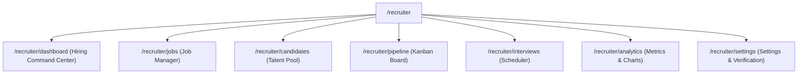
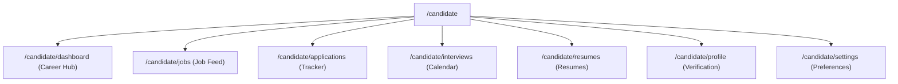

# Final Product Information Architecture & Wireframes - Phase 13K

This document freezes the product architecture, route structure, navigation trees, and component layouts for the Phase 13K Rebuild. 

---

## 1. Unified Authentication & Application Entry Flow

```
Landing Page (/)
    ├── Features (Feature Section Scroll)
    ├── Solutions (Scroll/Link)
    ├── Pricing (Coming Soon)
    ├── About (Info Section)
    ├── Login (/login) ────► Choose Role ──┬──► Recruiter Login (/recruiter/login)
    │                                       └──► Candidate Login (/candidate/login)
    └── Register (/register) ──► Choose Role ──┬──► Recruiter Register (/recruiter/register)
                                            └──► Candidate Register (/candidate/register)
```

---

## 2. Route Audit & Inventory

The route registry is frozen as follows:

| Route Path | Allowed Roles | Description | Status |
| :--- | :--- | :--- | :--- |
| `/` | Guest | Main SaaS Landing Page | Keep |
| `/login` | Guest | Unified login entry (select role) | **NEW** |
| `/register` | Guest | Unified registration entry (select role) | **NEW** |
| `/recruiter/login` | Guest | Recruiter Login form | Keep |
| `/recruiter/register` | Guest | Recruiter Registration form | Keep |
| `/recruiter/dashboard` | Recruiter | Hiring Command Center | **NEW** (Replaces legacy Dashboard.tsx) |
| `/recruiter/jobs` | Recruiter | Job Openings Manager | Keep |
| `/recruiter/candidates` | Recruiter | Talent Pool / Candidate Directory | Keep |
| `/recruiter/pipeline` | Recruiter | Kanban Sourcing Pipeline | Keep |
| `/recruiter/interviews` | Recruiter | Interview Scheduling Center | Keep |
| `/recruiter/analytics` | Recruiter | Performance & Sync Analytics | Keep |
| `/recruiter/settings` | Recruiter | Settings & Domain Verification | Keep |
| `/candidate/login` | Guest | Candidate Login form | Keep |
| `/candidate/register` | Guest | Candidate Registration form | Keep |
| `/candidate/dashboard` | Candidate | Candidate Career Hub | **NEW** (Replaces legacy CandidateDashboard.tsx) |
| `/candidate/resumes` | Candidate | Resume Upload Library | Keep |
| `/candidate/jobs` | Candidate | Recommended Jobs & Job Feed | Keep |
| `/candidate/applications` | Candidate | Application Status Tracker | Keep |
| `/candidate/interviews` | Candidate | Interview Calendar Booking | Keep |
| `/candidate/profile` | Candidate | Profile details & OTP Verification | Keep |
| `/candidate/settings` | Candidate | Jobseeker Preferences | Keep |
| `/recruiter/employees` | - | Legacy employee route | **REMOVE** |
| `/results` | - | Legacy sync results page | **REMOVE** (Migrated to Recruiter Settings) |

---

## 3. Recruiter Navigation Tree

Recruiter sidebar navigation is strictly isolated from candidate actions:



---

## 4. Candidate Navigation Tree

Candidate sidebar navigation is strictly isolated from recruiter actions:



---

## 5. Recruiter Dashboard Wireframe (Hiring Command Center)

The Recruiter Dashboard includes first-class AI elements, KPI summaries, and explicit Quick Actions:

```
+-----------------------------------------------------------------------------------+
|  ORYZO  (Workspace Name)                     [Quick Search]  [Recruiter Name v]  |
+-----------------------------------------------------------------------------------+
|  [DASHBOARD]                                                                      |
|  [JOBS]        +-----------------------------------+----------------------------+ |
|  [CANDIDATES]  | AI SCREENING QUEUE (First-Class)   | ACTION CENTER              | |
|  [PIPELINE]    | * Jane_CV.pdf (Scoring 94%...)    | * Action Needed: 3 new     | |
|  [INTERVIEWS]  | * Bob_CV.pdf (In Queue #2)        |   candidates to screen.    | |
|  [ANALYTICS]   +-----------------------------------+----------------------------+ |
|  [SETTINGS]    | OPEN JOBS                         | ACTIVE CANDIDATES          | |
|                | * Backend Engineer (3 active)     | * 8 Candidates in Stages   | |
|                +-----------------------------------+----------------------------+ |
|                | INTERVIEWS THIS WEEK              | PIPELINE HEALTH            | |
|                | * John Doe (Technical Exam)       | * Screening: 4 | Offer: 1  | |
|                +-----------------------------------+----------------------------+ |
|                | QUICK ACTIONS                                                  | |
|                | * [Create Job]                     * [Upload Candidate]        | |
|                | * [Review Applications]            * [Schedule Interview]       | |
|                +----------------------------------------------------------------+ |
|                | AI MATCH INSIGHTS & INDICATORS                                 | |
|                | * Jane Doe: Strong Skills Match (94%). Risk Score: Low.        | |
|                | * Candidate Summary: Experience matching requirement (Python)  | |
|                | * Recommendation: Proceed to Technical Panel Interview.        | |
|                +----------------------------------------------------------------+ |
|                | RECENT APPLICATIONS & HIRING METRICS                           | |
|                | * Alice Vance (Applied 2h ago, 82% match)                      | |
|                | * Average Applicability Match: 78.4%                           | |
|                +----------------------------------------------------------------+ |
+-----------------------------------------------------------------------------------+
```

---

## 6. Candidate Dashboard Wireframe (Career Hub)

The Candidate Dashboard focuses entirely on matching status and onboarding checklist completion.

```
+-----------------------------------------------------------------------------------+
|  ORYZO  (Candidate Profile)                                    [Candidate Name v] |
+-----------------------------------------------------------------------------------+
|  [DASHBOARD]                                                                      |
|  [JOBS]        +---------------------------------------+------------------------+ |
|  [APPLICATIONS]| CAREER PROGRESS                       | PROFILE COMPLETION     | |
|  [INTERVIEWS]  | Active Applications: 2                | +--------------------+ | |
|  [RESUMES]     | Upcoming Interviews: 1                | | Conic: 70% Complete| | |
|  [PROFILE]     +---------------------------------------+ +--------------------+ | |
|  [SETTINGS]    | VERIFICATION STATUS                   | RESUME STATUS          | |
|                | * Email: Verified [OK]                | * Resumes: 1 / 3       | |
|                | * Phone: Pending SMS Verification [⚠️] | * Default: Main_CV.pdf | |
|                +---------------------------------------+------------------------+ |
|                | RECOMMENDED JOBS (Based on extracted skills matching)          | |
|                | * Lead Frontend Engineer (92% Match score, React / CSS)        | |
|                | * Junior Developer (65% Match score, Node.js)                  | |
|                +----------------------------------------------------------------+ |
|                | ACTIVE APPLICATIONS                                            | |
|                | * Backend Engineer (Screening phase, applied 2 days ago)        | |
|                +----------------------------------------------------------------+ |
+-----------------------------------------------------------------------------------+
```

---

## 7. Results.tsx Functionality Migration Map

Dead Letter Queue monitoring, sync retry controls, and sync metrics must be fully migrated before `Results.tsx` is deleted:

### Migrated Destinations

1. **Dead Letter Queue (DLQ) Monitoring**
   - **Destination**: Rebuilt as a dedicated sub-panel inside **Recruiter Settings (/recruiter/settings)** under a tab/card named **HRIS Integrations & Sync DLQ**.
   - **Fields**: Provider, Failure Reason, Event Outbox ID, Created At, Status.

2. **Sync Retry Controls**
   - **Destination**: Integrated as a button (`Retry Sync`) beside each failed record in the settings DLQ panel (invokes `retryDlqRecord` API endpoint).

3. **Sync Metrics & Trends**
   - **Destination**: Migrated to a secondary section in **Recruiter Analytics (/recruiter/analytics)**. Displays success/failure counters and health ratios per provider.

---

## 8. Onboarding Flow Checklist

```
Recruiter Onboarding (5 Steps):
Step 1: Company Information (Company Details)
Step 2: Create First Job (Post Job opening)
Step 3: Configure Hiring Pipeline (Milestone Stages)
Step 4: Invite Team Members (Email Invite)
Step 5: Onboarding Setup Complete

Candidate Onboarding (6 Steps):
Step 1: Profile Information (Bio Statement)
Step 2: Upload Resume (Upload parsed resume)
Step 3: Verify Email (Email OTP Verification)
Step 4: Verify Phone (SMS OTP Verification)
Step 5: Skills Review (Extracted skills verification)
Step 6: Setup Complete
```
