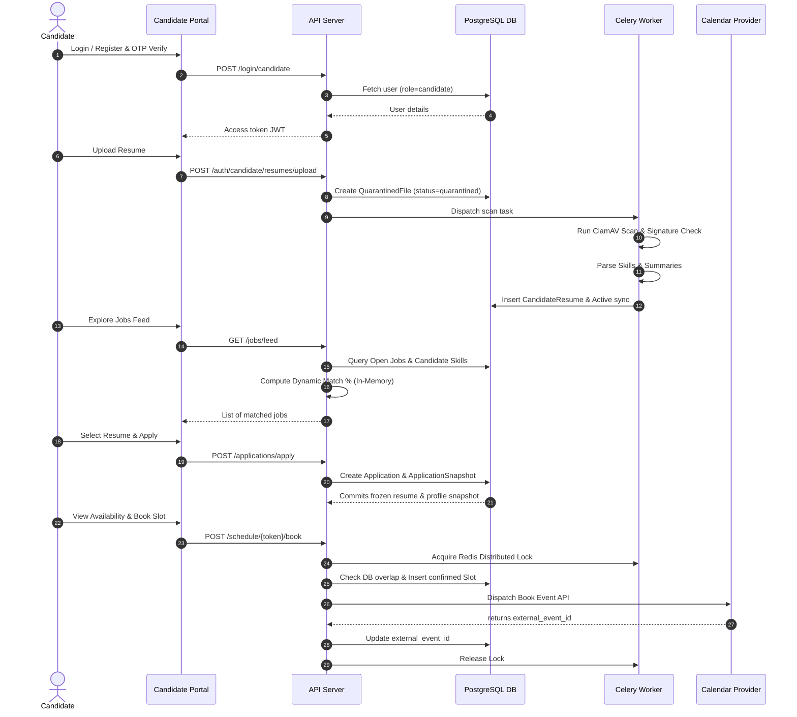

# Final Milestone Audit Report - Milestone 13: Candidate Workspace

This final audit report reviews the objectives, implementations, security controls, and architectural choices made throughout Milestone 13, establishing the complete verified candidate workspace ecosystem.

---

## 1. Original Milestone 13 Objectives
The primary focus of Milestone 13 was to pivot from a legacy employee onboarding shell to a complete candidate-facing hub, allowing candidates to safely manage their credentials, evaluate match requirements, book interviews, and monitor applications.
* **Objective 1**: Establish a secure Candidate Authentication layer (OTP + JWT).
* **Objective 2**: Build a unified responsive Candidate Workspace shell and Dashboard.
* **Objective 3**: Implement a secure candidate Resume Library supporting background malware scanning, provenance metadata parsing, and limit guards.
* **Objective 4**: Implement a Job Feed with personalized applicability matching.
* **Objective 5**: Implement an immutable Job Application snapshot system.
* **Objective 6**: Build Candidate-authenticated Interview slot scheduling, cancellation, and rescheduling.

---

## 2. Completed Features
* **Phase A (DNS/MX Mocking)**: Configured global DNS Resolver patching in the test suite to stabilize automated testing.
* **Phase B (Candidate Authentication)**: Implemented candidate registers/logins, email OTP verification pathways, and route guards protecting candidate views.
* **Phase C (Candidate Dashboard Shell)**: Designed and completed the CandidateLayout sidebar shell (light/dark themes) and main statistics dashboard.
* **Phase D (Resume Library)**: Completed drag-and-drop resume uploading, file size validation, Celery ClamAV scanning, parsed details extraction (skills/summaries), and active resume toggles.
* **Phase E (Job Feed & Application Flow)**: Restructured routers, executed application status enum migration, built the deterministic match engine, and developed the explore jobs dashboard and detail drawer.
* **Phase F (Applications & Interviews)**: Developed JWT-authenticated applications list and withdrawal flows, interview calendar views, and secure cancel/reschedule endpoints.

---

## 3. Database Changes Introduced
1. **[NEW] `candidate_resumes` table**: Stores metadata, active flags, parsed summaries, and skill arrays for candidate resumes.
2. **[MODIFY] `quarantined_files` table**: Modified `company_id` to be nullable, and added a foreign key `user_id` referencing candidate users.
3. **[MODIFY] `candidate_profiles` table**: Added `skills` (`JSONB`) and `summary` (`Text`) columns.
4. **[MODIFY] `application_status` Enum Migration**: Created Alembic migration [cba0fe9a3c10](file:///Users/krishnagarg/smartonboard-main/alembic/versions/cba0fe9a3c10_add_withdrawn_to_application_status.py) adding `'withdrawn'` to the `application_status` PostgreSQL enum type.

---

## 4. API Endpoints Added (16 Candidate Endpoints)
All routes are mounted under `/api/v1`:

| Router | Method | Path | Description |
| :--- | :--- | :--- | :--- |
| **Candidate Auth** | `POST` | `/auth/register/candidate` | Register candidate account (role: candidate) |
| | `POST` | `/auth/login/candidate` | Candidate authenticate (JWT response) |
| | `POST` | `/auth/candidate/email/send-otp` | Dispatch email verification OTP |
| | `POST` | `/auth/candidate/email/verify-otp` | Verify OTP and mark profile verified |
| | `GET` | `/auth/candidate/me` | Fetch active candidate user & profile fields |
| **Candidate Resumes** | `GET` | `/auth/candidate/resumes` | List candidate's resume library |
| | `POST` | `/auth/candidate/resumes/upload` | Stage file in quarantine for Celery scan |
| | `POST` | `/auth/candidate/resumes/{id}/toggle-active` | Toggle active status (triggers detail sync) |
| | `DELETE`| `/auth/candidate/resumes/{id}` | Permanently delete resume and files |
| **Candidate Jobs** | `GET` | `/jobs/feed` | List active jobs with match scoring |
| **Candidate Applications**| `POST` | `/applications/apply` | Apply to a job and commit snapshot |
| | `GET` | `/applications/me` | List candidate applications & snapshots |
| | `POST` | `/applications/{id}/withdraw` | Withdraw application, generate recruiter draft |
| **Candidate Interviews**| `GET` | `/candidate/interviews` | View scheduled interviews and booking slots |
| | `POST` | `/candidate/bookings/{id}/cancel` | Authenticated booking slot cancellation |
| | `POST` | `/candidate/bookings/{id}/reschedule` | Authenticated booking slot rescheduling |

---

## 5. Frontend Pages Added/Modified
* **Shell & Layout**: [CandidateLayout.tsx](file:///Users/krishnagarg/smartonboard-main/frontend/src/components/CandidateLayout.tsx)
* **Candidate Dashboard**: [CandidateDashboard.tsx](file:///Users/krishnagarg/smartonboard-main/frontend/src/pages/CandidateDashboard.tsx)
* **Resume Library**: [ResumeLibrary.tsx](file:///Users/krishnagarg/smartonboard-main/frontend/src/pages/ResumeLibrary.tsx)
* **Explore Jobs Feed**: [CandidateJobFeed.tsx](file:///Users/krishnagarg/smartonboard-main/frontend/src/pages/CandidateJobFeed.tsx)
* **Applications Tracker**: [CandidateApplications.tsx](file:///Users/krishnagarg/smartonboard-main/frontend/src/pages/CandidateApplications.tsx)
* **Interviews Calendar**: [CandidateInterviews.tsx](file:///Users/krishnagarg/smartonboard-main/frontend/src/pages/CandidateInterviews.tsx)
* **Profile Settings**: [CandidateProfilePage.tsx](file:///Users/krishnagarg/smartonboard-main/frontend/src/pages/CandidateProfilePage.tsx)

---

## 6. Background Workers Added/Modified
* **Celery Worker** ([celery_worker.py](file:///Users/krishnagarg/smartonboard-main/backend/celery_worker.py)):
  * Added role-aware promotion branching in `scan_and_promote_resume_task`.
  * Promotes candidate files safely to `storage/uploads/candidates/<user_id>/`.
  * Invokes the resume parser agent to extract skills/summaries, updates the database resume record, and keeps only one resume active (archiving others).

---

## 7. Security Controls Implemented
* **Malware & Virus Scan**: Integrates with ClamAV / EICAR signature validation and quarantine state staging.
* **Upload Constraints**: Enforces a strict 5MB file size limit and restricts formats to `.pdf`, `.docx`, and `.txt` at both client and server levels.
* **Tenant Isolation**: Bypasses recruiter RLS constraints safely (`auth_mode="true"`) only for candidate authentication and feed lookups, while strictly verifying email ownership for withdrawals and bookings.
* **Locking and Constraints**: Uses Redis distributed locks to prevent race conditions during slots booking/rescheduling. Database-level btree_gist exclusion constraints prevent overlapping confirmed slot bookings.

---

## 8. Candidate Workflow Diagram

---

## 9. Remaining Known Limitations
* **Inline Resume Previews**: The Resume Library does not support inline rendering of PDFs; candidates can only download files.
* **Hardcoded Working Hours**: Working hours for slot availability generation are hardcoded in UTC (9:00 to 17:00), ignoring candidate-specific timezones.
* **Mock integrations**: Calendar syncing is mock-driven in local testing (E-mail OTPs use console stdout).

---

## 10. Technical Debt Created
* **Shadowed Routes**: Candidate auth handlers (`register_candidate`, `login_candidate`, etc.) are duplicated/shadowed on the primary `auth_router` in `auth.py` to maintain backwards compatibility for imports in old test files.
* **RLS Bypasses**: Bypassing tenant-specific RLS rules (`auth_mode="true"`) is required for candidate feeds because candidates are cross-tenant/cross-company entities.

---

## 11. Recommended Milestone 14 Starting Point
Milestone 14 is the **Recruiter Workspace & Evaluation Layer**. The recommended starting point is:
1. **Extend Recruiter Pipeline views**: Enable recruiters to view the immutable candidate resume and profile snapshots directly within `CandidateDrawer.tsx` when evaluating historic applications.
2. **Review Auto-progression Rules**: Extend the scorecard feedback rules to support multi-stage candidate evaluations.
