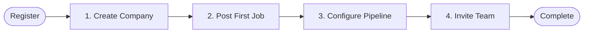
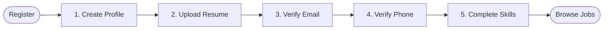

# First-Time User Onboarding Flow Report - Phase 13J

This report defines the guided, step-by-step onboarding journeys for new Recruiters and Candidates, preventing them from being dropped into a blank dashboard.

---

## 1. Onboarding Detection and State Tracking

1. **Detection Flag**: We will use a state attribute in the user profile model (or local persistent storage metadata `smartonboard_onboarded_v1`) to track whether a user has finished their onboarding wizard.
2. **Workflow Guard**: If `has_onboarded` is false, the user dashboard will render a full-screen, focused stepper wizard. Standard navigation links in the sidebar are disabled/locked during this flow to prevent users from escaping the onboarding sequence.

---

## 2. Recruiter Onboarding Journey

A recruiter's dashboard experience starts with configuring their company workspace.

### Flow Steps
1. **Create Company**: Recruiter inputs basic organization details (Company name, headquarters location, website, scale).
2. **Post First Job**: Recruiter adds their first job opening (Title, Department, Job Description).
3. **Configure Hiring Pipeline**: Recruiter chooses pipeline milestones (e.g., screening, technical exam, culture check, executive interview).
4. **Invite Team**: Recruiter sends invitation links to team members/co-recruiters.
5. **Complete**: Saves states, toggles `has_onboarded` to true, and drops them into the active Recruiter Dashboard (Hiring Command Center).

*Note: Organization DNS/MX verification has been moved out of the mandatory first-time onboarding flow and is located in the Company Settings / Verification Center under Recruiter Settings (`/recruiter/settings`).*

---

## 3. Candidate Onboarding Journey

A candidate's dashboard experience focuses on establishing identity verification and loading credentials.

### Flow Steps
1. **Create Profile**: Candidate inputs core bio details and job search preferences.
2. **Upload Resume**: Uploads a primary resume document (triggering background parsing to populate basic profile skills).
3. **Verify Email**: Candidate inputs the OTP verification code sent to their registered email address.
4. **Verify Phone**: Candidate inputs the SMS OTP verification code sent to their phone number.
5. **Complete Skills**: Candidate confirms extracted skills list and updates missing keywords.
6. **Browse Jobs**: Saves state, unlocks applicability matching percentages, and launches Candidate Job Feed.
