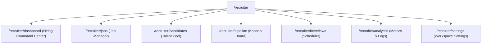
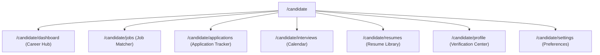
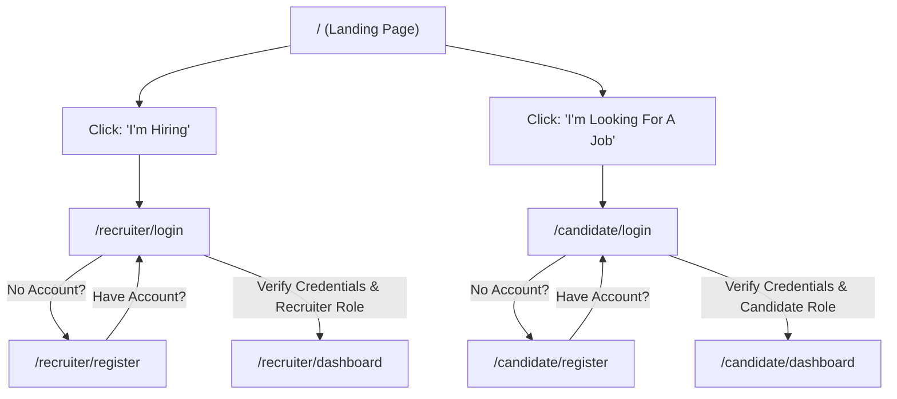

# Product Information Architecture & Wireframes - Phase 13J

This document presents the product architecture, wireframes, flows, maps, and screen relationships required for the **Phase 13J UX Rebuild**.

---

## 1. Recruiter Navigation Tree

Recruiter links are strictly isolated within the company navigation bar.



---

## 2. Candidate Navigation Tree

Candidate links are isolated within the candidate layout dashboard.



---

## 3. Recruiter Dashboard Wireframe (Hiring Command Center)

The Recruiter Dashboard is restructured to serve as a focused workspace layout.

```
+-----------------------------------------------------------------------------------+
|  SmartOnboard (Workspace Name)               [Quick Search]  [Recruiter Name v]  |
+-----------------------------------------------------------------------------------+
|  [DASHBOARD]                                                                      |
|  [JOBS]        +----------------------------------------------------------------+ |
|  [CANDIDATES]  | ACTION CENTER (Pending Screening Tasks & Critical Alerts)     | |
|  [PIPELINE]    | * Urgent: 3 Candidates waiting for screening on 'Software Eng' | |
|  [INTERVIEWS]  | * Warning: Organization MX record not verified                  | |
|  [ANALYTICS]   +---------------------------------------+------------------------+ |
|  [SETTINGS]    | OPEN JOBS                             | PIPELINE HEALTH        | |
|                | * Software Engineer (3 active)        | * Total Applicants: 14 | |
|                | * Product Manager (1 active)          | * In Screening: 5      | |
|                | * Data Scientist (0 active)           | * Offer Made: 2        | |
|                +---------------------------------------+------------------------+ |
|                | AI SCREENING QUEUE                    | UPCOMING INTERVIEWS    | |
|                | * Jane_resume.pdf (Scoring...)        | * John Doe - 10:00 AM  | |
|                | * Bob_resume.pdf (Queue position #2)  | * Alice Smith - 2:00 PM| |
|                +---------------------------------------+------------------------+ |
|                | HIRING METRICS                                                 | |
|                | * Average Applicability Match: 78.4%                           | |
|                | * Days to Close (Avg): 14.5 days                               | |
|                +----------------------------------------------------------------+ |
+-----------------------------------------------------------------------------------+
```

---

## 4. Candidate Dashboard Wireframe (Career Hub)

The Candidate Dashboard focuses entirely on matching status and onboarding checklist completion.

```
+-----------------------------------------------------------------------------------+
|  SmartOnboard (Candidate Profile)                              [Candidate Name v] |
+-----------------------------------------------------------------------------------+
|  [DASHBOARD]                                                                      |
|  [JOBS]        +---------------------------------------+------------------------+ |
|  [APPLICATIONS]| CAREER PROGRESS                       | PROFILE COMPLETION     | |
|  [INTERVIEWS]  | Active Applications: 2                | +--------------------+ | |
|  [RESUMES]     | Upcoming Interviews: 1                | | Conic: 70% Complete| | |
|  [PROFILE]     +---------------------------------------+ +--------------------+ | |
|  [SETTINGS]    | VERIFICATION STATUS                   | RESUME STATUS          | |
|                | * Email: Verified [OK]                | * Resumes: 1 / 3       | |
|                | * Phone: Pending SMS Verification [⚠️] | * Default: Main_CV.pdf | |
|                +---------------------------------------+------------------------+ |
|                | RECOMMENDED JOBS (Based on extracted skills matching)          | |
|                | * Lead Frontend Engineer (92% Match score, React / CSS)        | |
|                | * Junior Developer (65% Match score, Node.js)                  | |
|                +----------------------------------------------------------------+ |
|                | ACTIVE APPLICATIONS                                            | |
|                | * Backend Engineer (Screening phase, applied 2 days ago)        | |
|                +----------------------------------------------------------------+ |
+-----------------------------------------------------------------------------------+
```

---

## 5. Landing Page Wireframe (Entry Gateway)

Eliminates abstract decorative images, presenting clear value-focused messaging and entrance gateways.

```
+-----------------------------------------------------------------------------------+
|  SmartOnboard                                  [I'm Hiring]  [I'm Looking for Job]|
+-----------------------------------------------------------------------------------+
|                                                                                   |
|                   Verify. Screen. Hire with Confidence.                           |
|          The verified hiring ecosystem for resume screening, AI candidate         |
|          matching, automated applicant verification, and interview scheduling.    |
|                                                                                   |
|          +----------------------------------+  +----------------------------------+ |
|          | FOR RECRUITERS                   |  | FOR CANDIDATES                   | |
|          |                                  |  |                                  | |
|          | I'M HIRING                       |  | I'M LOOKING FOR A JOB            | |
|          | Publish jobs, parse resumes with |  | Verify your profile, parse skills| |
|          | AI, manage pipeline, schedule.   |  | check match scores, and apply.   | |
|          |                                  |  |                                  | |
|          | [ Start Recruiting ]             |  | [ Find Matching Jobs ]           | |
|          +----------------------------------+  +----------------------------------+ |
|                                                                                   |
|  -------------------------------------------------------------------------------  |
|                                                                                   |
|   RESUME SCREENING     *     CANDIDATE MATCHING     *     INTERVIEW SCHEDULING    |
|   Twilio SMS / Email OTP      Skills match score        Calendar coordination     |
|                                                                                   |
|  -------------------------------------------------------------------------------  |
|   SmartOnboard - Verified Hiring Platform                                         |
+-----------------------------------------------------------------------------------+
```

---

## 6. Authentication Flow Diagram

Defines role selection before entering the credential forms.



---

## 7. Onboarding Flow Diagram

Guides new users through essential profile configurations before showing the full dashboard.

```mermaid
graph TD
    subgraph Recruiter Onboarding
        R1[Create Company Details] --> R2[Post First Job Opening]
        R2 --> R3[Configure Pipeline Workflow]
        R3 --> R4[Invite Team Members]
        R4 --> R5[Set Onboarding Complete]
    end

    subgraph Candidate Onboarding
        C1[Input Profile Bio] --> C2[Upload Initial Resume]
        C2 --> C3[Verify Email OTP]
        C3 --> C4[Verify Phone SMS OTP]
        C4 --> C5[Validate Extracted Skills]
        C5 --> C6[Set Onboarding Complete]
    end
```



---

## 8. Settings Architecture

The Settings workspace is isolated to support configuration needs for each user class.

### Recruiter Settings (`/recruiter/settings`)
1. **Profile**: Personal name, email, credentials.
2. **Company Settings**: Headquarters details, website, MX/DNS domain verification configurations, and workspace members.
3. **Billing & Subscriptions**: Billing history, subscription indicator showing "Coming Soon" placeholder card.
4. **Verification Policies**: Enforced security parameters (e.g. required SMS OTP for applicants).

### Candidate Settings (`/candidate/settings`)
1. **Account**: Email preferences, password resets.
2. **Verification Settings**: View phone and email validation states (with action link to Profile OTP center).
3. **Application Preferences**: Hide/show profile match percentages for job feeds.

---

## 9. Screen Relationship Map

```mermaid
graph TD
    subgraph Recruiter Screen Scope
        RD["/recruiter/dashboard"] <--> RJ["/recruiter/jobs"]
        RD <--> RC["/recruiter/candidates"]
        RD <--> RP["/recruiter/pipeline"]
        RD <--> RI["/recruiter/interviews"]
        RD <--> RA["/recruiter/analytics"]
        RD <--> RS["/recruiter/settings"]
    end

    subgraph Candidate Screen Scope
        CD["/candidate/dashboard"] <--> CJ["/candidate/jobs"]
        CD <--> CA["/candidate/applications"]
        CD <--> CIn["/candidate/interviews"]
        CD <--> CR["/candidate/resumes"]
        CD <--> CP["/candidate/profile"]
        CD <--> CS["/candidate/settings"]
    end

    style RD fill:#382416,stroke:#ffedd7,stroke-width:2px
    style CD fill:#100904,stroke:#ffedd7,stroke-width:2px
```



---

## 10. User Journey Maps

### Recruiter Journey
- **User Person**: Sarah (Recruiting Manager)
- **Phase 1: Entry & Setup**: Sarah lands on SmartOnboard, clicks "Start Recruiting", registers her company, and completes the onboarding wizard by posting her first job opening, setting up her pipeline, and inviting team members.
- **Phase 2: Sourcing**: Sarah's posted "Backend Engineer" job is published. She goes to Settings to verify the company's DNS/MX domain records.
- **Phase 3: Screen & Match**: Sarah uploads applicant resumes to the queue. The parsing pipeline runs, calculating suitability percentages.
- **Phase 4: Select & Close**: Sarah reviews the pipeline kanban board, schedules technical screening interviews, and tracks overall metrics.

### Candidate Journey
- **User Person**: David (Software Engineer)
- **Phase 1: Entry & Trust Setup**: David lands on SmartOnboard, selects "Find Matching Jobs", registers, and completes OTP email and SMS code entries to get verified.
- **Phase 2: Upload**: David uploads his resume, extracting his skills checklist.
- **Phase 3: Match & Apply**: David views recommended jobs. He applies to a "Lead React Developer" position showing a high match score.
- **Phase 4: Track**: David prepares for an interview, schedules/reschedules via calendar, and follows his application status in his hub.
