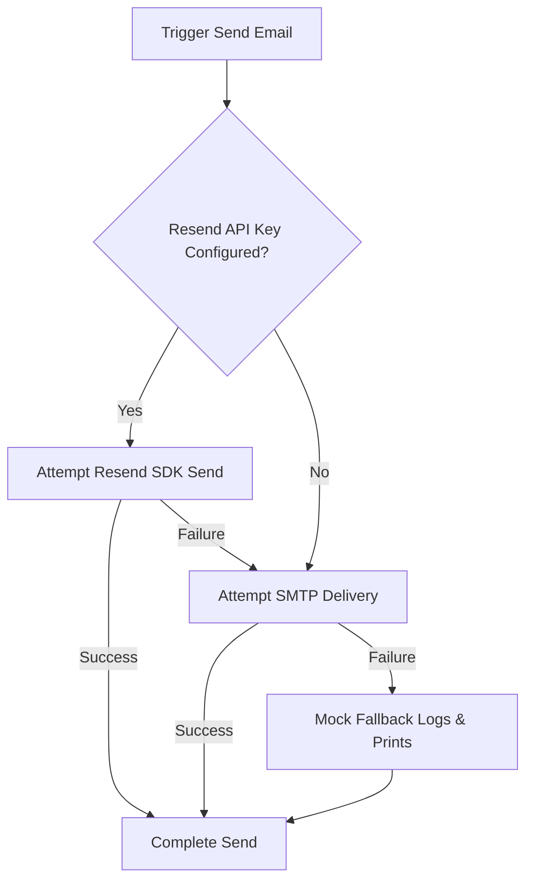

# Resend Email Integration Audit Report

This report outlines the implementation details, HTML template structures, fallback mechanisms, and verification procedures for the Resend email infrastructure in SmartOnboard.

## 1. Executive Summary

As part of Phase 14C, the legacy SMTP-only email system has been upgraded to support a robust, multi-tier fallback chain utilizing **Resend** as the primary delivery channel, with **SMTP** and **Mock** services serving as secondary and tertiary fallbacks. This architecture ensures high-deliverability email notifications, standard security envelopes, and full developer/local testability without external service dependencies.

---

## 2. Resend Email Provider Implementation

The Resend delivery logic is implemented in [resend_provider.py](file:///Users/krishnagarg/smartonboard-main/backend/core/auth_providers/resend_provider.py).

### Environment Variables
* **`RESEND_API_KEY`**: Exposes the Resend API credentials. If absent, empty, or set to a mock value (e.g., starts with `mock-`), the provider silently yields control to SMTP or Mock fallbacks.
* **`RESEND_SENDER_EMAIL`**: Specifies the sender identity (e.g., `no-reply@smartonboard.com`). If not set, it defaults to the Resend default sandbox sender: `onboarding@resend.dev`.

### Code Reference
The provider is structured as follows:
```python
class ResendEmailProvider:
    @classmethod
    def _deliver(cls, to: str, subject: str, html: str) -> bool:
        api_key = cls._get_api_key()
        if not api_key:
            logger.info(f"[RESEND MOCK] Would send email via Resend to={to} subject='{subject}'")
            return False

        try:
            resend.api_key = api_key
            sender = cls._get_sender()
            resend.Emails.send({
                "from": sender,
                "to": to,
                "subject": subject,
                "html": html
            })
            logger.info(f"Resend successfully sent email to {to}")
            return True
        except Exception as e:
            logger.error(f"Resend delivery failed for {to}: {e}")
            return False
```

---

## 3. Fallback Chain Design

The fallback chain logic resides in [email.py](file:///Users/krishnagarg/smartonboard-main/backend/core/auth_providers/email.py) (class `EmailProvider`). It coordinates email dispatch across three tiers:



### Core Abstractions:
1. **Tier 1 (Resend)**: Sends through `ResendEmailProvider`. Returns `True` on success.
2. **Tier 2 (SMTP)**: If Resend is not configured or fails, it falls back to the existing SMTP delivery logic (`EmailProvider._send_via_smtp`).
3. **Tier 3 (Mock Fallback)**: If both Resend and SMTP fail (or are unconfigured), the system falls back to logging the message details to stdout/logs, returning success to prevent blocking user actions in development.

---

## 4. HTML Email Templates

Pre-configured, responsive, modern HTML templates are included directly in the Resend provider:
* **Verification OTP**: Contains a styled 6-digit block with a 10-minute expiry warning.
* **Password Reset**: Contains a call-to-action button linking to `http://localhost:5173/reset-password?token={token}&email={email}` with a 30-minute expiry warning.
* **General Notification**: Contains standard greeting, customizable markdown-ready body text, and system metadata footer.

---

## 5. Verification & Fallback Chain Logs

During tests or development, verification attempts generate clear tracing output:
* **Resend Mock Delivery (No API Key)**:
  `INFO smartonboard.auth_providers.resend - [RESEND MOCK] Would send email via Resend to=owner_sourcing@corp.com subject='Verify Your SmartOnboard Email'`
* **SMTP Bypass (SMTP Unconfigured)**:
  `INFO smartonboard.auth_providers.email - [SMTP FALLBACK] SMTP not configured. Skipping SMTP step.`
* **Mock Fallback Resolution**:
  `INFO smartonboard.auth_providers.email - [EMAIL MOCK FALLBACK] Email verification code sent to owner_sourcing@corp.com with code 956415`
  `EMAIL MOCK FALLBACK: To=owner_sourcing@corp.com, Subject=Verify Your SmartOnboard Email`

---

## 6. Test Suite Compliance

All tests in [test_resend_email.py](file:///Users/krishnagarg/smartonboard-main/tests/test_resend_email.py) pass and validate the following components:
* `test_resend_provider_mock_fallback_and_api_call`: Validates that Resend uses mock fallback when unconfigured, and triggers the SDK calls when provided credentials.
* `test_email_provider_fallback_chain`: Confirms the fallback chain cascades correctly (`Resend -> SMTP -> Mock`).
