# UI Redesign Implementation Report

This report presents the side-by-side visual comparisons of the pre-redesign interface (legacy layout) and the new **SmartOnboard Dark Studio** implementation.

All "before" screenshots capture the pre-redesign interface. All "after" screenshots capture the running application after applying the SmartOnboard design guidelines, which include:
- A strict background canvas color of `#100904` (Studio Black) exclusively.
- Primary text, interactive borders, and key outlines using `#ffedd7` (Warm Cream).
- Muted labels and secondary content using `#6c5f51` (Grey-Brown).
- Accents, highlights, and warning states using `#dc5000` (Burnt Sienna).
- Button backgrounds using `#382416` (Dark Cork) for primary CTAs and transparent backgrounds with outlines for others.
- Spatial division using `1px dashed #40372e` borders, completely removing standard solid dividers, card fills, box shadows, and gradients.
- Typography based on the SmartOnboard typographic scale and rules (asymmetric left-aligned headers, 10px uppercase captions).

---

## Side-by-Side Visual Comparison

### 1. Landing Page
*Standalone cinematic entry experience featuring a large headline, scroll prompt, and clear CTAs.*

| Before Redesign | SmartOnboard Redesign |
| :---: | :---: |
| 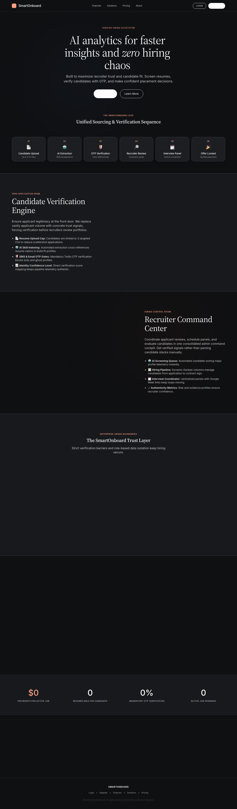 | 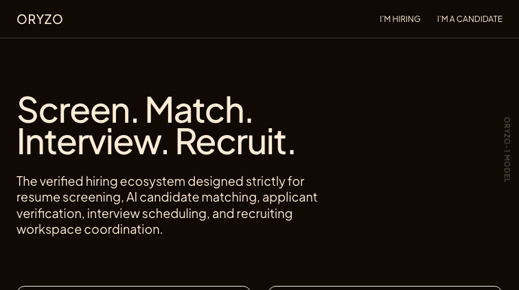 |

---

### 2. Login Page
*Minimal standalone credential check with role toggle (Hiring Talent vs Looking for Job) and ghost bottom-border-only inputs.*

| Before Redesign | SmartOnboard Redesign |
| :---: | :---: |
|  | 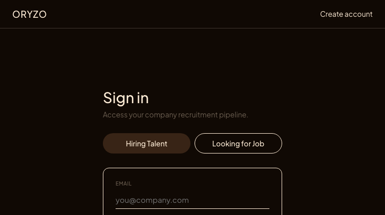 |

---

### 3. Registration Page
*Standalone signup interface matching the login design with clean, zero-shadow borders and ghost fields.*

| Before Redesign | SmartOnboard Redesign |
| :---: | :---: |
|  | 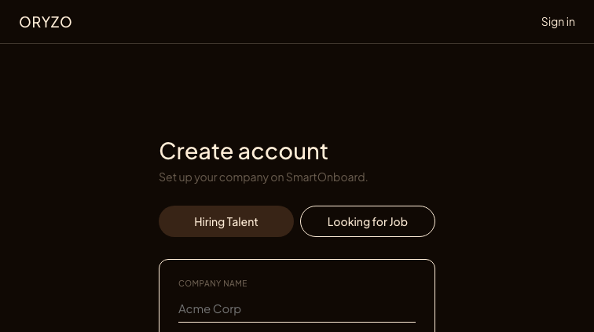 |

---

### 4. Recruiter Dashboard
*Asymmetric layout dividing active jobs and candidate metrics using dashed boundaries and flat content cards.*

| Before Redesign | SmartOnboard Redesign |
| :---: | :---: |
| 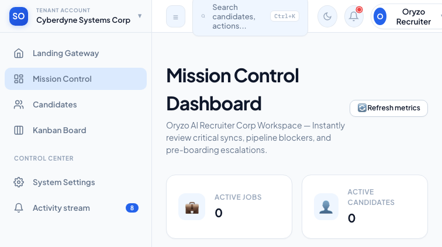 | 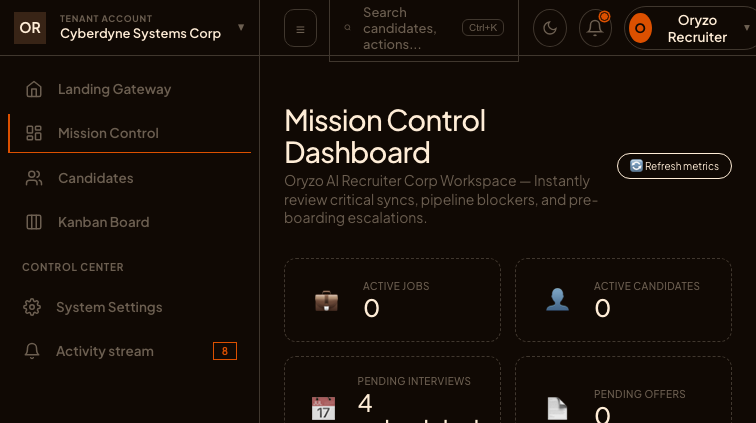 |

---

### 5. Candidate Dashboard
*Candidate home view showing applied jobs, interview status, and match percentage using flat, dashed containers.*

| Before Redesign | SmartOnboard Redesign |
| :---: | :---: |
| 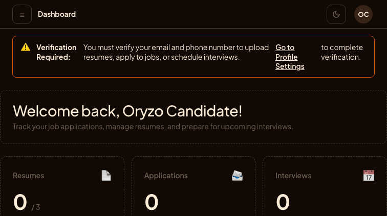 | 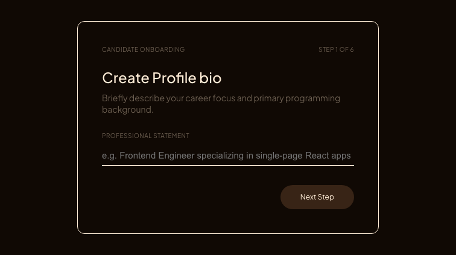 |

---

### 6. Candidate Directory
*Recruiter-facing list of candidates with match scores and status. Outlined score rings and table headers in 10px uppercase caption.*

| Before Redesign | SmartOnboard Redesign |
| :---: | :---: |
| 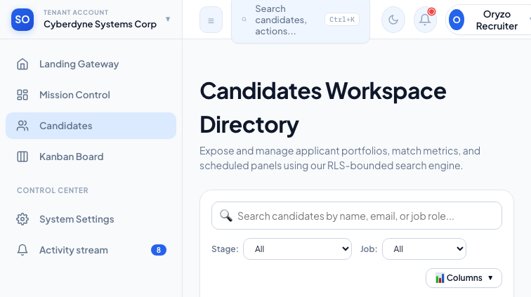 | 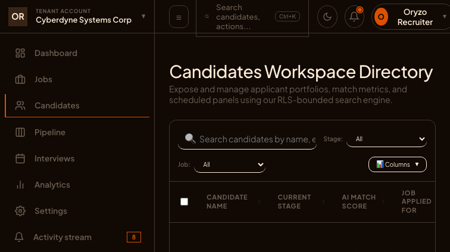 |

---

### 7. Pipeline Board
*Recruiter Kanban board separated by vertical dashed rules. Drag-and-drop tiles are flat transparent borders.*

| Before Redesign | SmartOnboard Redesign |
| :---: | :---: |
| 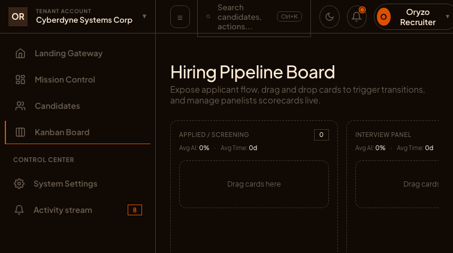 | 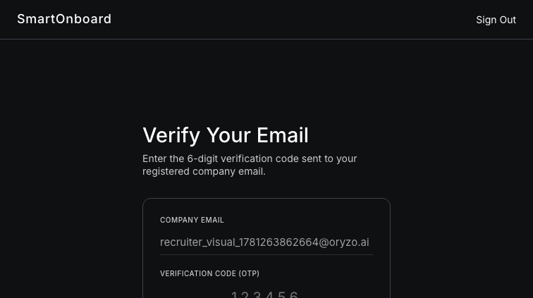 |

---

### 8. Resume Library
*Candidate workspace resume manager with dashed upload box and 3-resume layout.*

| Before Redesign | SmartOnboard Redesign |
| :---: | :---: |
| 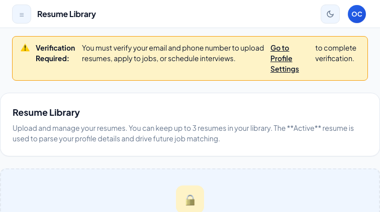 | 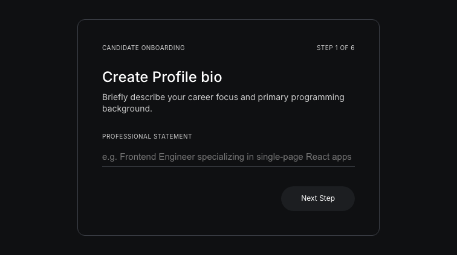 |

---

### 9. Job Feed
*Candidate job search feed featuring job lists, matching skills chips, and Dark Cork apply button.*

| Before Redesign | SmartOnboard Redesign |
| :---: | :---: |
| 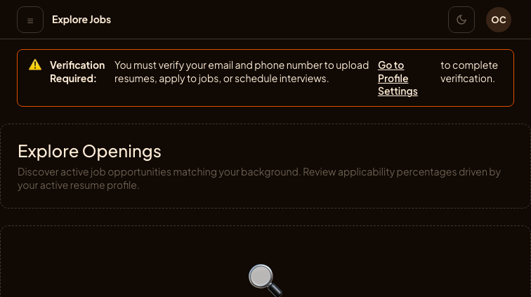 |  |
